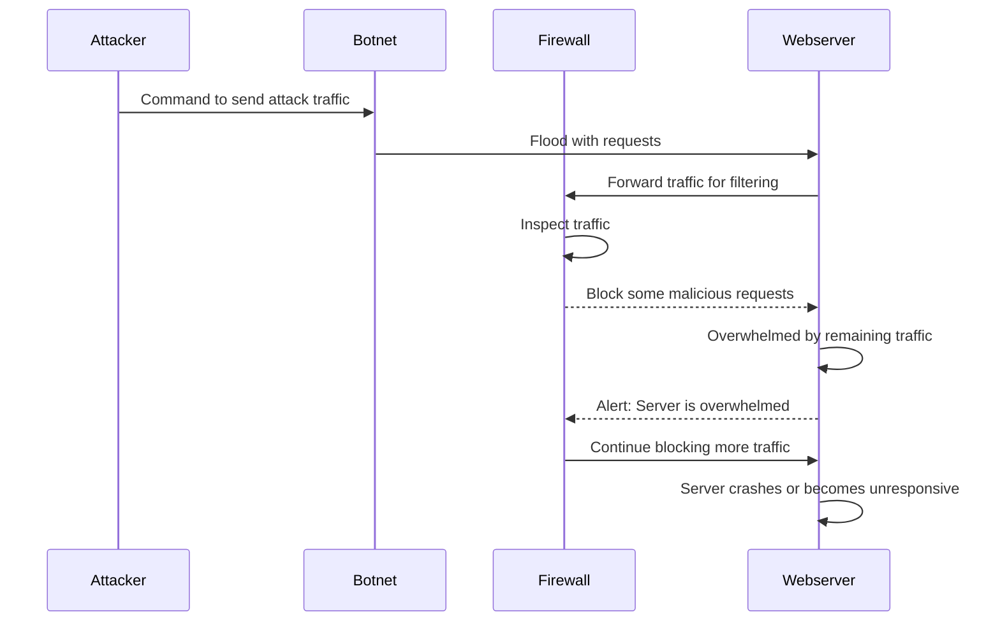

* The Attacker sends instructions to the Botnet to launch an attack on a target (such as a website).

* The Botnet, a network of compromised devices, starts sending harmful traffic (like many requests or a DDoS attack) to the Firewall.

* The Firewall checks the incoming traffic. If it looks like an attack, it will block it. If it’s not suspicious, it lets the traffic through to the next step.

* The Webserver starts getting overwhelmed by the attack. It asks the Firewall to inspect the traffic for any threats

* The Firewall checks the traffic for malicious content. If it finds any, it blocks it to protect the Webserver.

* The Webserver sends back a response to the Botnet, telling it the attack was blocked or failed (e.g., it may return an error message).

* The Botnet sends the Attacker feedback, letting them know whether the attack was successful or if defenses blocked it.
